<h1 align="center">
    
</h1>

## 💻 Sobre o projeto

A Modelagem e a prototipação de um sistema voltado a gestão de dados de uma universidade. Essa modelagem deve ser feita, utilizando os diagramas da UML (Linguagem de Modelagem Unificada), e o protótipo deve ser Desenvolvido usando ferramentas como Miro ou Figma refletindo o que foi modelado.

A modelagem e a prototipação em questão, deve representar o cadastro de diferentes tipos de pessoas que vão interagir com esse sistema.

O diagrama de caso de uso, diagrama de classe e a prototipação deve representar no mínimo os seguinte cenários:
- Cadastro de Pessoa Física
- Cadastro de Pessoa Jurídica
- Cadastro de Professores
- Cadastro de Fornecedores
- Cadastro de Alunos

🎨 O layout do Projeto desenvolvido O Protótipo está dispovível no [Figma.](https://www.figma.com/proto/tAeMExzTUFX0zjOrCbBei2/Projeto-Integrador-Senac-(entrega-dia-25%2F11)?node-id=10-2514&node-type=canvas&t=fw6vxcIqph1gUvwr-1&scaling=scale-down&content-scaling=fixed&page-id=0%3A1&starting-point-node-id=10%3A2529).

## 🛠 Sistema

As seguintes ferramentas foram usadas na construção do projeto:

## 📂 Estruturas de pastas

```
├── assets
│   │── descricao_caso_de_uso_1.png
│   │── descricao_caso_de_uso_2.png
│   │── descricao_caso_de_uso_3.png
│   │── descricao_caso_de_uso_4.png
│   │── descricao_caso_de_uso_5.png
│   │── diagrama-de-classe.png
│   │── diagrama-caso-uso.png
│   └── senac-ead-logo.jpg
├── LICENSE  
└── README.md
```

## 🚧  Etapas da Avaliação da primeira entrega e Progresso:

<table>
  <thead>
    <tr>
      <th>Tarefas</th>
      <th>Andamento</th>      
    </tr>
  </thead>
 <tbody>
    <tr>
      <td>1. O grupo precisará desenvolver um diagrama de caso de uso que represente os seguinte cenários;</td>
      <td>✅ Feito.</td>
    </tr>
    <tr>
      <td>2. O grupo deve elaborar a descrição dos cenários dos casos de uso construídos, levando em consideração um cenário principal, dois cenários alternativos, pré-condição e pós-condição;</td>
      <td>✅ Feito.</td>
    </tr>    
    <tr>
      <td>3. Elaborar um diagrama de classe que esteja de acordo com a proposta de projeto. Esse diagrama deve conter pelo menos 5 classes;</td>
      <td>✅ Feito.</td>
    </tr>
   </tbody>
</table>

## 🚧  Etapas da Avaliação da segunda entrega e Progresso:

<table>
  <thead>
    <tr>
      <th>Tarefas</th>
      <th>Andamento</th>      
    </tr>
  </thead>
 <tbody>
    <tr>
      <td>1. O grupo precisará desenvolver os protótipos da interface do sistema, de acordo com os diagramas de caso de uso que foram desenvolvidos na primeira fase do projeto;</td>
      <td>✅ Feito.</td>
    </tr>  
    <tr>
      <td>2. Todos os integrantes do grupo precisam criar uma conta no GitHub. O grupo precisará se reunir e definir qual dos integrantes do grupo ficará responsável pela criação do repositório para o projeto.;</td>
      <td>✅ Feito.</td>
    </tr>
    <tr>
      <td>3. o grupo deverá se organizar para criar o arquivo de documentação (readme.md) e anexar todos os protótipos desenvolvidos, incluindo também na documentação os diagramas que foram criados na fase 1 do projeto em formato Markdown</td>
      <td>✅ Feito.</td>
    </tr>
   </tbody>
</table>

## 🧱 Diagrama de Casos de Uso:

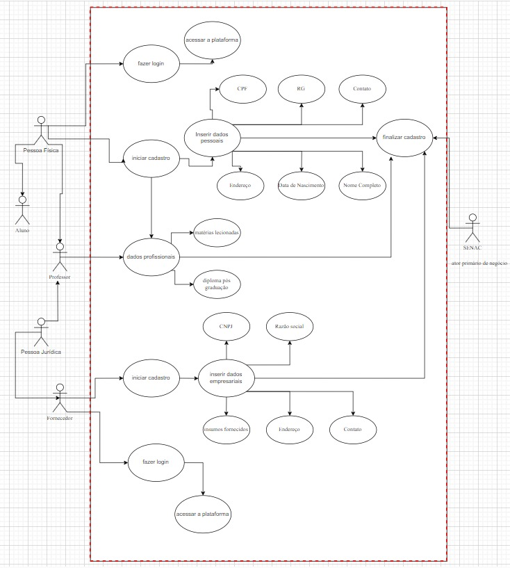


## 📝 Descrição dos Cenários de Casos de Uso:
### ✏️ Caso de Uso 1
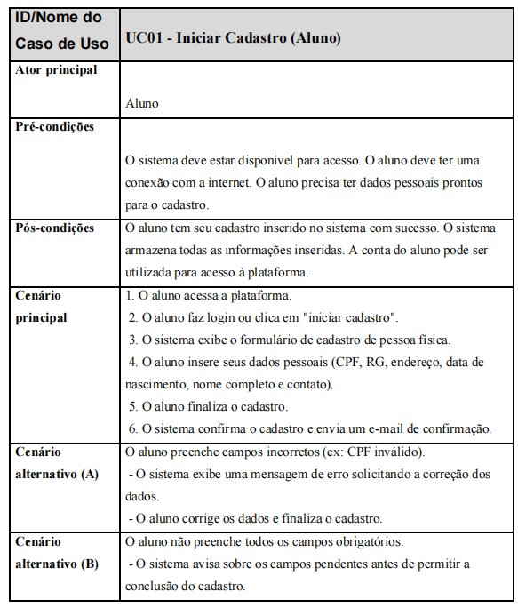
### ✏️ Caso de Uso 2
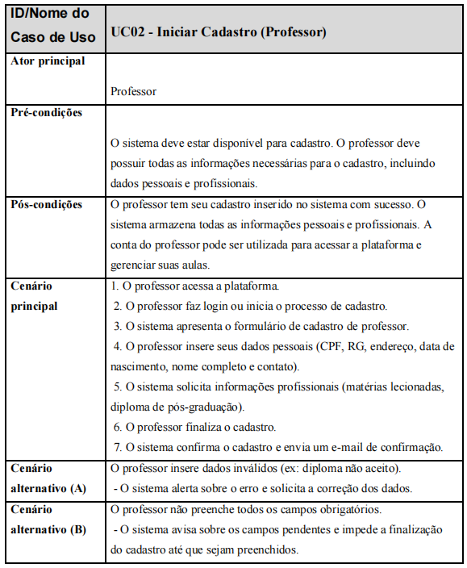
### ✏️ Caso de Uso 3
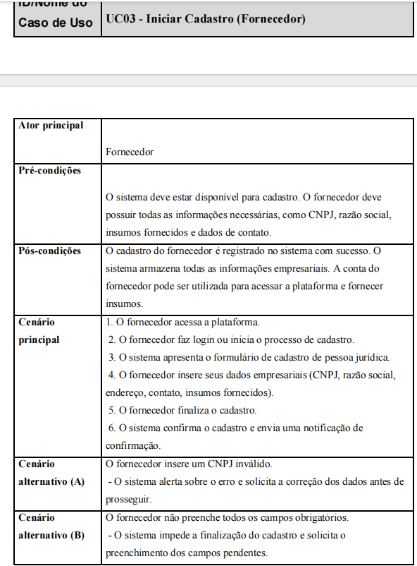
### ✏️ Caso de Uso 4
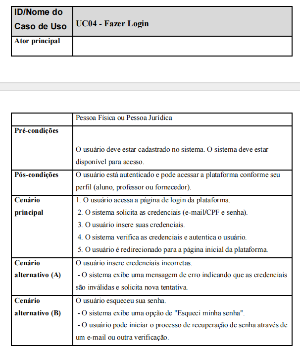
### ✏️ Caso de Uso 5
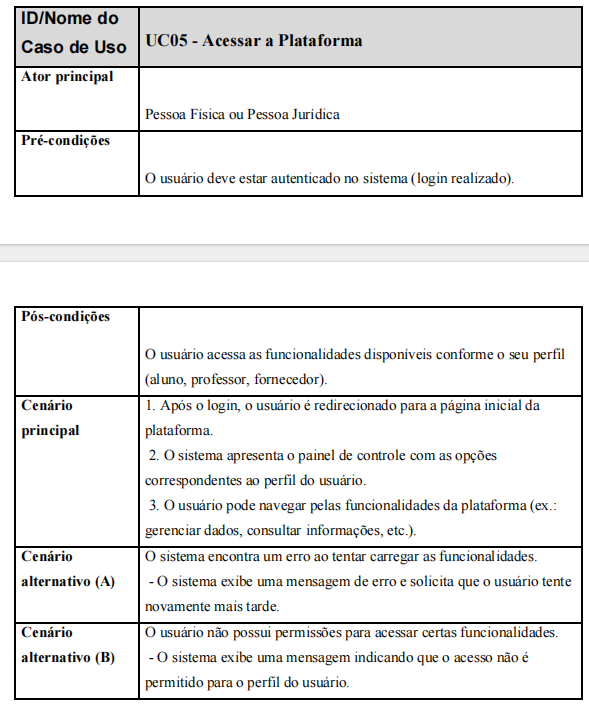

## 🏛️ Diagrama de Classe:

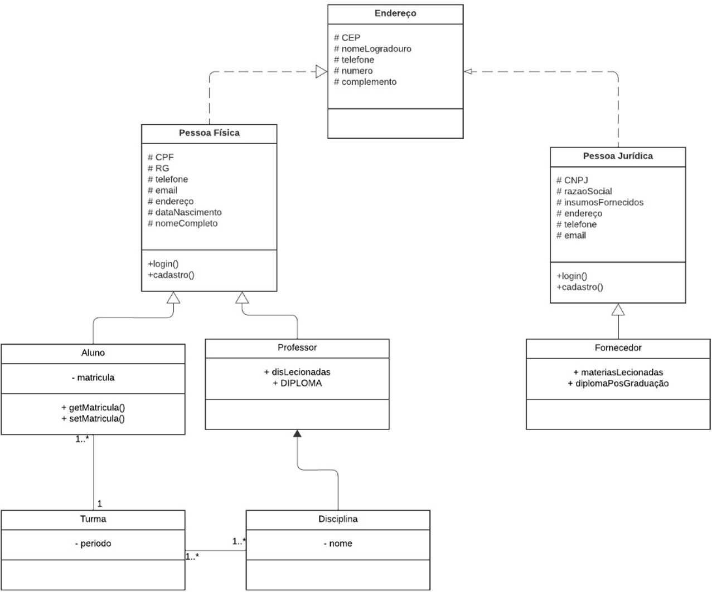


## 📱 Prototipação de alta fidelidade:
### 📲 Tela de Início
<div style="display: flex;">
  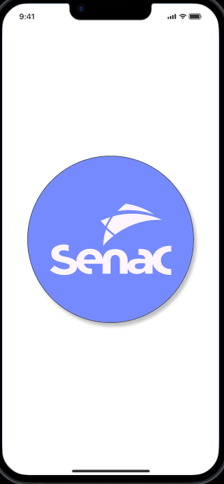
  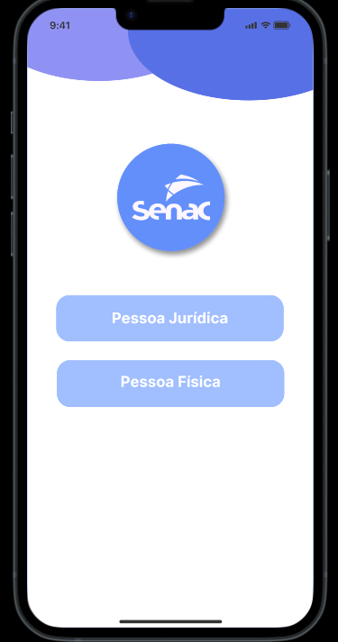
  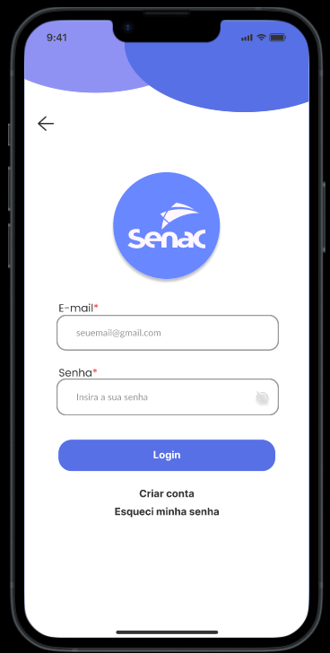
</div>

### 📲 Tela de Cadastro Pessoa Física (Aluno/Professor)
<div style="display: flex;">
  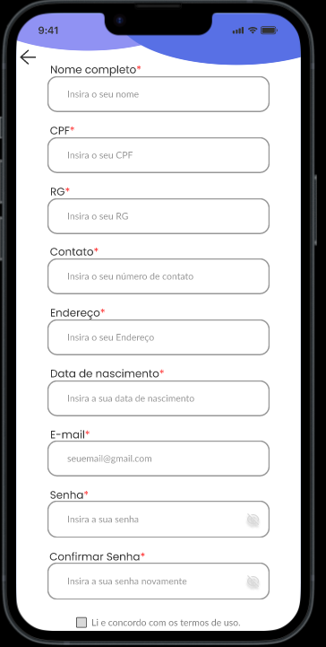
  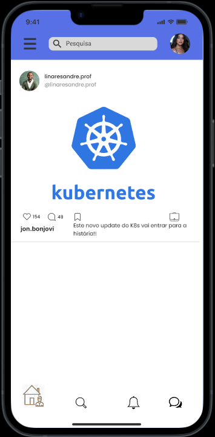
  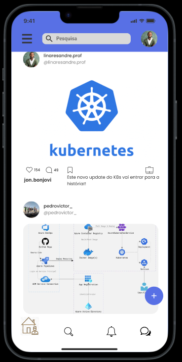
</div>

### 📲 Tela de Cadastro Pessoa Jurídica (Professor/Fornecedor)
<div style="display: flex;">
  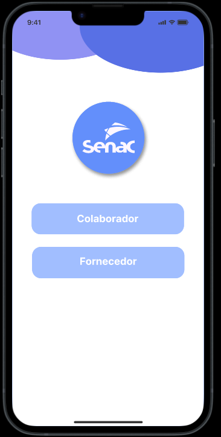
  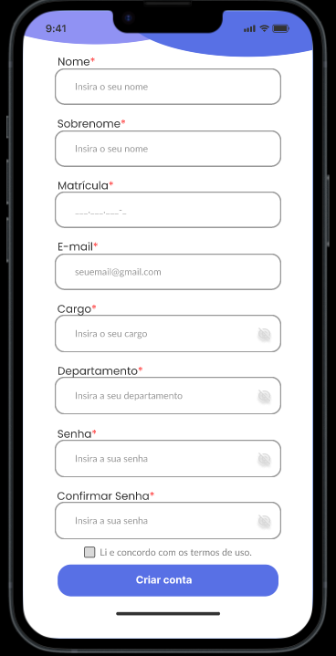
  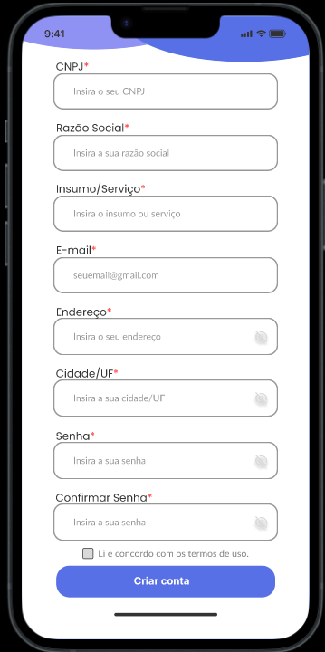
</div>


***
## ⏳ Futuro do projeto
  <table>
    <thead>
      <tr>
        <th>Recurso</th>
        <th>Descriçao</th>
      </tr>
    </thead>
    <tbody>
        <tr>
          <th>Front-end Web e Mobile</th>
          <th>A construção de uma aplicação Web e mobile para utilização do sistema. Utilizando HTML, CSS e JavaScript, ou um Framework como React ou Angular. E a aplicação Mobile podendo ser feita em React Native, ou Kotlin e Swift</th>
        </tr>
         <tr>
          <th>Back-end em Java</th>
          <th>Para que o sistema seja completo, se faz necessário a construção de um backend para fazer as operações de CRUD. A tecnologia escolhida foi Java, para que esteja de acordo com a tecnologia utilizado no semestre.</th>
        </tr>
         <tr>
          <th>Banco de Dados Relacional</th>
          <th>Utilização de um banco de dados para armazenar os dados dos alunos, professores e fornecedores.</th>
        </tr>
    </tbody>
  </table>

***

<table>
  <tr>
    <td align="center"><a href="https://www.linkedin.com/in/alberto-janeiro"><br /><sub><b>Alberto Janeiro Durán Filho</b></sub></a><br />❤️</td>
    <td align="center"><a href=""><br /><sub><b>Alice de Carvalho Plentz</b></sub></a><br />❤️</td>
    <td align="center"><a href=""><br /><sub><b>Carla Bianca Nascimento de Araújo</b></sub></a><br />❤️</td>
    <td align="center"><a href=""><br /><sub><b>Ezequiel Costa Bomfim</b></sub></a><br />❤️</td>
    <td align="center"><a href=""><br /><sub><b>Willyan Rafael de Freitas</b></sub></a><br />❤️</td>
  </tr>
</table>